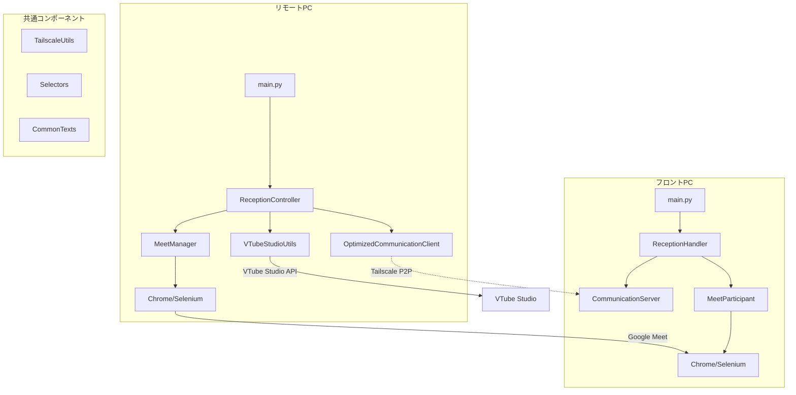

# VTuber Reception System - システム構成仕様書

## 概要

VTuber受付システムは、リモートPC（オペレーター側）とフロントPC（受付端末）の2台構成で動作する無人受付システムです。

## システム全体構成



## ディレクトリ構造と責務

### リモートPC側 (`src/remote/`)

#### `main.py`

- **役割**: リモートPC側のエントリーポイント
- **主要機能**:
  - コマンドライン引数の解析
  - ReceptionControllerの初期化と実行
- **クラス**: なし（関数のみ）
- **主要関数**:
  - `main()`: メイン処理

#### `reception_controller.py`

- **役割**: 受付システムの全体制御
- **主要機能**:
  - VTube Studio起動確認
  - Meet URL生成・送信
  - 受付セッションの管理
  - プロセス監視と終了処理

**クラス: ReceptionController**

```python
class ReceptionController:
    def __init__(front_pc_ip, port, skip_extension_check, skip_account_check)
    def start_reception_session() -> bool
    def wait_for_session_end() -> None
    def end_reception_session() -> None
    def cleanup() -> None
    def run() -> None
    def _handle_chrome_exit() -> None
```

#### `meet_manager.py`

- **役割**: Google Meet関連の操作管理
- **主要機能**:
  - Meet URL生成（Google Meet API）
  - Chrome起動・Meet参加
  - 拡張機能確認
  - Auto-Admit機能制御

**クラス: MeetManager**

```python
class MeetManager:
    def __init__()
    def create_meet_space() -> str
    def setup_browser() -> None
    def join_as_host(meet_url: str) -> None
    def enable_auto_admit() -> None
    def check_extension(extension_url: str, extension_name: str) -> bool
    def ensure_google_login() -> None
    def cleanup() -> None
    def is_session_active() -> bool
    def start_process_monitoring() -> None
    def _authenticate() -> None
```

#### `communication_client_optimized.py`

- **役割**: フロントPCとの高速通信管理
- **主要機能**:
  - Tailscale経由の接続管理
  - 接続プール・キャッシュ機能
  - Meet URL・コマンド送信

**クラス: OptimizedCommunicationClient**

```python
class OptimizedCommunicationClient:
    def __init__(front_pc_name, port, timeout, resolve_timeout, pre_connect)
    def connect() -> bool
    def send_meet_url(meet_url: str) -> bool
    def send_command(command: str, params: dict) -> bool
    def send_notification(message: str) -> bool
    def disconnect(reuse: bool) -> None
    def is_connected() -> bool
    def _get_pooled_connection() -> socket
    def _return_to_pool() -> None
    def _quick_connect() -> bool
    def _verify_tailscale_once() -> bool
    def _resolve_device_name_cached() -> str
    @classmethod clear_cache()
    @classmethod preload_devices(device_names: list)
```

### フロントPC側 (`src/front/`)

#### `main.py`

- **役割**: フロントPC側のエントリーポイント
- **主要機能**:
  - ReceptionHandlerの初期化と実行
- **クラス**: なし（関数のみ）
- **主要関数**:
  - `main()`: メイン処理

#### `reception_handler.py`

- **役割**: リモートPCからの指示受信・処理
- **主要機能**:
  - 通信サーバーの管理
  - Meet URL受信・Meet参加
  - コマンド処理・終了制御

**クラス: ReceptionHandler**

```python
class ReceptionHandler:
    def __init__(host, port, display_name)
    def run() -> None
    def stop_reception() -> None
    def _register_handlers() -> None
    def _handle_meet_url(data: dict) -> None
    def _handle_command(data: dict) -> None
    def _handle_notification(data: dict) -> None
    def _join_meeting(meet_url: str) -> None
    def _leave_meeting() -> None
    def _end_reception() -> None
    def _force_cleanup() -> None
    def _handle_chrome_exit() -> None
```

#### `communication_server.py`

- **役割**: リモートPCからの通信受信
- **主要機能**:
  - TCP/IPサーバーの管理
  - JSON形式メッセージの受信・解析
  - ハンドラー登録・呼び出し

**クラス: CommunicationServer**

```python
class CommunicationServer:
    def __init__(host, port)
    def register_handler(message_type: str, handler: callable) -> None
    def start() -> None
    def stop() -> None
    def is_running() -> bool
    def _handle_client(client_socket: socket) -> None
    def _process_message(data: dict) -> dict
```

#### `meet_participant.py`

- **役割**: Google Meetへのゲスト参加管理
- **主要機能**:
  - Chrome起動・Meet参加
  - Geminiポップアップ処理
  - プロセス監視・終了検知

**クラス: MeetParticipant**

```python
class MeetParticipant:
    def __init__(display_name)
    def join_meeting(meet_url: str) -> bool
    def leave_meeting() -> bool
    def cleanup() -> None
    def is_in_meeting() -> bool
    def set_chrome_exit_callback(callback: callable) -> None
    def start_process_monitoring() -> None
    def _join_as_guest(meet_url: str) -> bool
    def _handle_gemini_popup() -> None
    def _setup_chrome() -> webdriver.Chrome
    def _monitor_chrome_process() -> None
    def _get_chrome_pid() -> int
```

### 共通コンポーネント (`src/utils/`, `src/common/`)

#### `tailscale_utils.py`

- **役割**: Tailscale関連ユーティリティ
- **主要機能**:
  - Tailscaleステータス確認
  - デバイス名→IP変換
  - ネットワーク設定確認

**主要関数**:

```python
def check_and_setup_tailscale() -> tuple[bool, str]
def get_global_ip() -> str
class TailscaleUtils:
    @staticmethod get_tailscale_devices() -> dict
    @staticmethod resolve_device_name(device_name: str) -> str
    @staticmethod _get_status_data() -> dict
```

#### `vtube_studio_utils.py`

- **役割**: VTube Studio関連ユーティリティ
- **主要機能**:
  - VTube Studioプロセス監視
  - 自動起動機能

**主要関数**:

```python
def check_vtube_studio_running() -> bool
def launch_vtube_studio() -> bool
def check_and_setup_vtube_studio() -> tuple[bool, str]
```

#### `config.py`

- **役割**: システム設定・定数の一元管理
- **主要機能**:
  - Meet関連XPath定数
  - Chrome Web Store関連XPath定数
  - よく使用されるテキスト定数
  - システム設定値

**クラス**:

## データフロー

### 1. システム起動フロー

```
リモートPC起動 → VTube Studio確認 → Meet URL生成 → フロントPC接続 → Meet URL送信 → Chrome起動 → Meet参加
```

### 2. 通信プロトコル

- **トランスポート**: TCP/IP over Tailscale
- **フォーマット**: JSON
- **ポート**: 9999（固定）

**メッセージ形式**:

```json
{
    "type": "meet_url|command|notification",
    "content": "実際の内容",
    "timestamp": "ISO8601形式",
    "params": {} // commandの場合のみ
}
```

### 3. 終了フロー

```
Chrome終了検知 → プロセス監視検知 → 相手側に終了コマンド送信 → 両側クリーンアップ
```

## パフォーマンス最適化

### 接続最適化

- **キャッシュ**: Tailscaleデバイス解決結果（5分間）
- **接続プール**: ソケット接続の再利用
- **並列処理**: 事前接続・バックグラウンド処理
- **タイムアウト**: 適切な短縮設定

### プロセス監視

- **監視間隔**: 2秒（Chrome/Meetプロセス）
- **リソース効率**: psutilライブラリによる軽量監視
- **異常検知**: PID追跡・URL確認・DOM要素確認

## セキュリティ仕様

### 通信セキュリティ

- **P2Pネットワーク**: Tailscaleによる暗号化通信
- **認証**: デバイス単位での認証
- **ファイアウォール**: 必要ポートのみ開放

### 認証情報管理

- **Google API**: OAuth2フロー、token.jsonでの管理
- **機密情報**: 環境変数・設定ファイルでの分離

## エラーハンドリング

### 通信エラー

- **接続失敗**: リトライ機能・タイムアウト設定
- **ネットワーク切断**: 自動検知・クリーンアップ
- **プロトコルエラー**: 詳細ログ・回復処理

### アプリケーションエラー

- **Chrome異常終了**: プロセス監視による検知
- **Meet API制限**: エラーハンドリング・ユーザー通知
- **拡張機能エラー**: スキップオプション・回避機能

## 設定・カスタマイズ

### 環境設定

- **Python**: 3.11以上
- **依存関係**: pyproject.toml管理
- **Chrome**: 日本語版前提

### カスタマイズポイント

- **設定ファイル**: `config.py`での一元管理
- **テキスト定数**: `CommonTexts`クラス
- **プロセス監視**: 監視間隔・条件設定
- **通信設定**: タイムアウト・ポート設定
