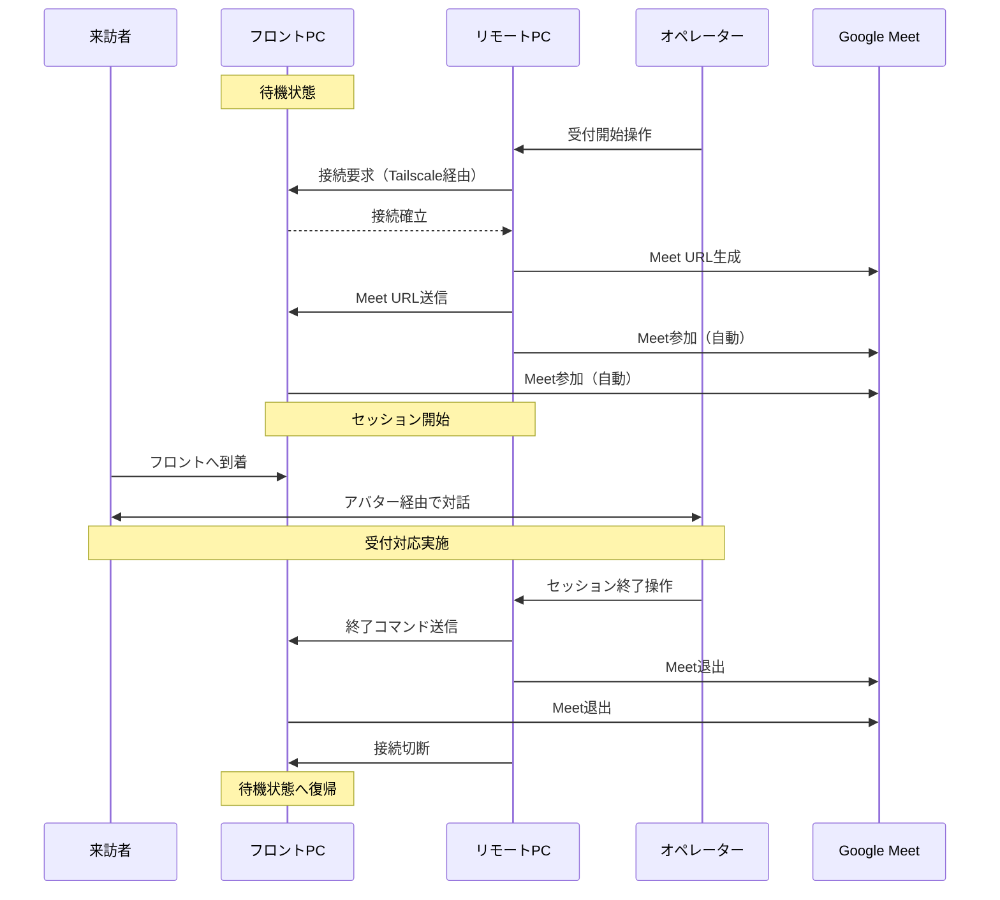

# 要件定義書（Requirements Definition Document）

## 🎯 プロジェクト概要： VTuber受付システム（VTuber Reception System）

### 背景

プランニングオフィス株式会社が運営する複数拠点のホテルにおいて、フロント業務の無人化を実現したい。

### 目的

- ホテルフロントの無人化
- VTuberアバターを活用した親しみやすい接客体験の提供

### 提案ソリューション

VTube Studioとビデオ会議ツール (Google Meet) を組み合わせ、簡易的なVTuber受付システムを実現する。

- リモートPC（オペレーター側）とフロントPC（受付端末）の2台構成で、スモールスタートのためGoogle Meetで接続する。（WebRTCは用いない）
- アバター操作には、リモートPC（オペレーター側）にてVTube Studioを利用する。

### スコープ

#### 対象業務

- ホテルフロントでの来訪者受付対応
- 基本的な案内・問い合わせ対応

#### システム範囲

- 受付セッションの開始・終了制御
- リモートPC・フロントPC間の通信制御
- Google Meetセッション管理
- VTube Studioアバター表示制御
- オペレーター向け操作画面（GUI）
- 異常検知とエラー通知

#### 対象外

- 宿泊予約システムとの連携
- 決済処理
- 鍵の自動受け渡し
- 多言語対応（初期フェーズ）


## 🧩 用語定義

| 用語 | 定義 |
|------|------|
| **リモートPC** | オペレーターが操作する遠隔制御端末。Google Meetのホスト役を担う |
| **フロントPC** | ホテルフロントに設置される受付端末。来訪者と対面する |
| **オペレーター** | リモートPCから受付対応を行う担当者 |
| **来訪者** | ホテルを訪れ、受付端末を利用するゲスト |
| **受付セッション** | 受付開始から終了までの一連の対応プロセス |
| **VTube Studio** | VTuberアバターを表示・制御するためのソフトウェア |
| **Google Meet** | ビデオ会議プラットフォーム（GCP Meet API利用） |
| **Tailscale** | 異なるネットワーク間でのセキュアなP2P通信を実現するVPNサービス |
| **通信サーバー** | フロントPC上で動作し、リモートPCからの接続を待ち受けるTCPサーバー（ポート9999） |
| **通信クライアント** | リモートPC上で動作し、フロントPCへ接続するTCPクライアント |
| **WebDriver** | Seleniumを用いたブラウザ自動操作ツール |


## ⌛ AS-IS / To-Be

### 既存の有人受付フロー

```text
[来訪者] → [受付カウンター] → [フロントスタッフ]
                                      ↓
                              ・挨拶・本人確認
                              ・案内・説明
                              ・キー受け渡し（手動）
```

- 課題：複数拠点での人員確保コスト


### VTuber受付システムによる無人受付フロー

```text
[来訪者] → [フロントPC] ←─ネットワーク経由─→ [リモートPC] ← [オペレーター]
               ↓                                      ↓
         Google Meet参加    ←────────────────→    Google Meetホスト
               ↓                                      ↓
         来訪者との対話   ←─リアルタイム映像・音声─→   オペレーター対応
```

【期待効果】

- **24時間対応**: 1拠点のリモートオペレーターが複数拠点をカバー可能
- **コスト削減**: 拠点ごとの常駐スタッフ不要
- **柔軟な人員配置**: オペレーターはリモートから複数拠点を担当可能


## 📝 業務要件（Business Requirements）

### BR-01: 受付対応業務

来訪者がフロントPCを通じて、リモートのオペレーターと対話できること。

### BR-02: リモート接続管理

リモートPCとフロントPCが安全に接続・通信できること。Tailscaleを介した接続と、接続前後のネットワーク健全性チェックを実施。

### BR-03: Google Meetセッション管理

受付セッションごとにGoogle Meetミーティングを生成・管理できること。

### BR-04: VTuberアバター表示制御

フロントPCでVTuberアバターを表示し、来訪者に親しみやすいインターフェースを提供すること。

### BR-05: 異常検知とエラー通知

システム異常（接続断、ブラウザ異常終了）を検知し、Slack通知・GUI表示を行うこと。

### BR-06: 操作GUI

オペレーターが直感的に操作できるGUIを提供すること。


## 🔧 機能要件（Functional Requirements）

### FR-01: リモートPCからの接続機能

リモートPCからフロントPCへTCP接続（ポート9999）を確立する。

### FR-02: Google Meet URL生成・送信機能

リモートPCでGoogle Meet URLを生成し、フロントPCへ送信する。

### FR-03: フロントPCでのMeet参加機能

フロントPCが受信したMeet URLに自動参加する。

### FR-04: リモートPCでのMeet参加機能

リモートPCがGoogle Meetにホストとして参加する。

### FR-05: セッション終了機能

オペレーターがセッションを終了し、システムを待機状態に戻す。

### FR-06: 異常検知・通知機能

接続断やChromeブラウザ異常終了を検知し、自動クリーンアップを実行する。Slack通知は、起動・接続完了・切断完了・終了・エラーのみを送信する。

### FR-07: ネットワーク健全性チェック

アプリ起動時および利用者操作に応じて、Wi-Fi接続有無やTailscale稼働状況を診断し、問題があればGUIで明示する。


## 🌊 システム化業務フロー



## 💻 機能要件：画面と遷移

### リモートPC画面

```text
┌──────────────────────────────┐
│ リモート接続コントローラ       │
├──────────────────────────────┤
│ 状態: 待機中                  │
│ 詳細: （接続先やMeet URLを表示）│
│ ネットワーク: 診断結果           │
│ エラー: （必要時のみ表示）       │
│--------------------------------│
│ [接続先ドロップダウン]  ⟳再取得 │
│ [接続を開始]   [セッション終了]   │
│ *接続中はChromeが自動起動します │
└──────────────────────────────┘
```

#### 画面遷移

1. 起動時：ネットワーク診断 → 接続先がない場合はエラーメッセージ
2. フロントPCを選択し「接続を開始」→ 接続準備中 → 接続中（Meet生成・送信・ブラウザ起動）
3. セッション中は「セッション終了」のみ操作可能
4. セッション終了後は自動的に待機状態へ復帰

### フロントPC画面

```text
┌──────────────────────────────┐
│ 受付ステータス                  │
├──────────────────────────────┤
│ 見出し: 待機中 / 接続中 / エラー │
│ 詳細: リモート端末名などを表示    │
│ ネットワーク: 診断結果           │
│ [ネットワークを再確認]          │
│ エラー: （必要時のみ表示）       │
│ オペレーターの指示に従ってください│
└──────────────────────────────┘
```

#### 画面遷移

1. 起動時：ネットワーク診断 → 問題なければ「待機中」を表示
2. リモートPCが接続 → 「接続中」を表示し、Meet自動参加
3. セッション中：フロント側で追加操作は不要
4. セッション終了コマンド受信 → Meet退出 → 「待機中」に戻る


## 🫶 非機能要件

### 性能

| 項目 | 要件 |
|-----|-----|
| **起動時間** | リモートPC・フロントPCともにシステムの起動時間は10秒以内に収まること |
| **接続確立時間** | リモートPCからフロントPCへの接(meet参加完了まで)は30秒以内に完了すること |
| **応答性** | GUI操作に対するレスポンスは1秒以内であること |
| **ハートビート間隔** | 5秒ごとにハートビートを送信し、接続状態を確認すること |
| **映像・音声遅延** | Google Meetの映像・音声遅延は2秒以内であること（Google Meet依存） |

### 可用性

| 項目 | 要件 |
|-----|-----|
| **稼働時間** | 24時間365日稼働可能であること |
| **自動復旧** | 接続断発生時、自動的にクリーンアップを実行し、待機状態へ復帰すること |
| **エラーハンドリング** | 予期しないエラー発生時、システムがハングせずにエラーログを出力すること |
| **再接続機能** | 切断後、手動で再接続可能であること |

### セキュリティ

| 項目 | 要件 |
|-----|-----|
| **Slack通知** | Slack Webhook URLは環境変数で管理し、ハードコードしないこと |

### 運用監視

| 項目 | 要件 |
|-----|-----|
| **通知** | Slack通知は起動・接続完了・切断完了・終了・エラーに限定し、不要な常時ログは送信しないこと |
| **状態可視化** | GUI上で接続状態、セッション状態をリアルタイムで表示すること |
| **監視項目** | 接続状態、Chromeプロセス状態、ハートビート状態を監視すること |
